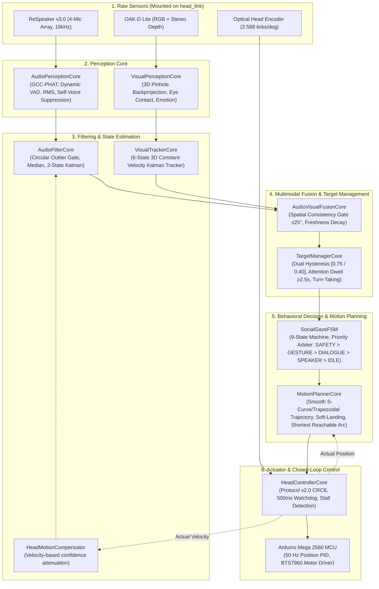

# ASTRO — Greenfield Social Robot Head Gaze System Architecture

## 1. Executive Summary

This document defines the greenfield architecture of the **ASTRO Social Robot Head Gaze & Audio-Visual Speaker Tracking System**. 

The architecture completely discards monolithic callback-driven control paradigms in favor of a strictly decoupled, feedback-controlled, and testable perception-control pipeline.

---

## 2. Architectural Principles & Guarantees

1. **Separation of Concerns:**  
   Perception never directly writes to motor registers or publishes raw angles to hardware. Every stage has a defined data contract dataclass (`AudioObservation`, `FilteredAudioState`, `VisualTargetTrack`, `FusedTarget`, `TargetState`, `GazeCommand`, `TrajectoryPoint`, `HeadFeedback`).
2. **Deterministic 50 Hz Control Loop:**  
   Motor trajectories are evaluated synchronously at $50\text{ Hz}$ ($20\text{ ms}$ interval), isolating sensor callback jitter from physical motor driving.
3. **Circular Angle Mathematics:**  
   All angular calculations strictly handle the $180^\circ / -180^\circ$ circular branch seam using `wrap_deg`, `angular_diff_deg`, and `circular_mean_deg`.
4. **Natural Social Dynamics:**  
   Implements psychological attention dwell times ($\ge 2.5\text{ s}$), deadbands ($\ge 3.0^\circ$), and organic soft-landing deceleration profiles.
5. **Multi-Speaker Turn-Taking:**  
   Allows an expedited switch when a new speaker speaks distinctly ($\ge 20^\circ$ separation) for $\ge 0.80\text{ s}$.
6. **Safety & Self-Suppression:**  
   Automatic self-voice suppression when the robot is speaking, motion self-noise confidence attenuation during head turns, and hardware watchdog lockout if host-MCU communication is interrupted.
