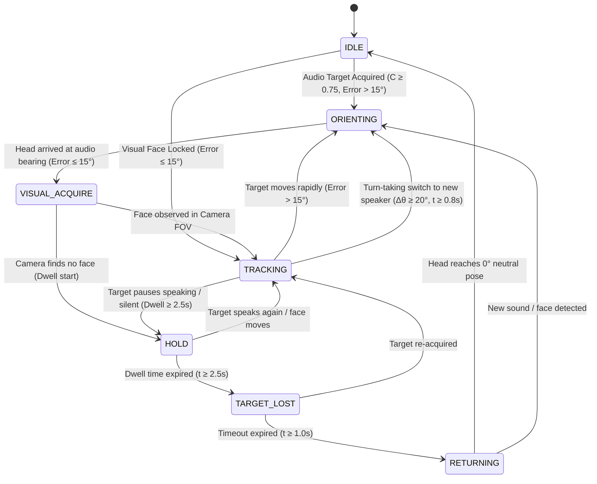

# ASTRO — Social Gaze Finite State Machine & Priority Arbitration

## 1. 9-State Social Gaze Machine

The behavioral decision layer governs head orientation through a 9-State Finite State Machine (FSM):

---

## 2. Detailed State Descriptions

| State | Purpose | Entry Condition | Commanded Gaze |
| :--- | :--- | :--- | :--- |
| **`IDLE`** | Resting neutral state | No active targets; head at center | $0.0^\circ$ (with optional $\pm 3.5^\circ$ breathing micro-saccades every 8s) |
| **`SEARCHING`** | Evaluating candidate cues | Low confidence acoustic cues | Holds current pose |
| **`AUDIO_ACQUIRE`** | Acoustic confirmation | Audio confidence $\ge 0.75$ | Prepares orientation trajectory |
| **`ORIENTING`** | Rapid head saccade | Target angle error $> 15.0^\circ$ | Commanded to target azimuth |
| **`VISUAL_ACQUIRE`** | Camera FOV acquisition | Head within $15.0^\circ$ of audio cue | Holds bearing, camera scans for face |
| **`TRACKING`** | Smooth visual pursuit | Face confirmed in camera frame | Tracks 3D filtered face position |
| **`HOLD`** | Social attention dwell | Target stops speaking / pauses | Maintains gaze for $\ge 2.5\text{ s}$ |
| **`TARGET_LOST`** | Short-term coasting | Target absent after dwell | Holds last known bearing for $1.0\text{ s}$ |
| **`RETURNING`** | Smooth recentering | Target lost timeout expired | Smooth trajectory returning to $0.0^\circ$ |

---

## 3. Priority Arbitration Hierarchy

When multiple behavioral demands conflict, `SocialGazeFSM` evaluates strict priority hierarchy:

1. **`SAFETY` (Priority 1 - Highest):**  
   Triggered by emergency stop or sleep mode. Immediately commands $0.0^\circ$ and disables background tracking.
2. **`GESTURE` (Priority 2):**  
   Scripted social gestures (`nod`, `shake`, `tilt`, `scan`, `center`). Overrides background speaker tracking during execution.
3. **`DIALOGUE` (Priority 3):**  
   Explicit cognitive dialogue intent (e.g. looking at conversational partner during speech turn).
4. **`ACTIVE_SPEAKER` (Priority 4):**  
   Multimodal or acoustic target currently speaking.
5. **`VISUAL_PERSON` (Priority 5):**  
   Silent person detected in environment.
6. **`IDLE` (Priority 6 - Lowest):**  
   Neutral resting posture.

---

## 4. Anti-Jitter Deadband & Hysteresis

- **Gaze Deadband ($\theta_{deadband} = 3.0^\circ$):** If the new target position differs by less than $3.0^\circ$ from the currently commanded position, the motor command is held steady.
- **Dual-Threshold Hysteresis:** Target requires $C \ge 0.75$ to become active, but remains locked as long as $C \ge 0.40$.
